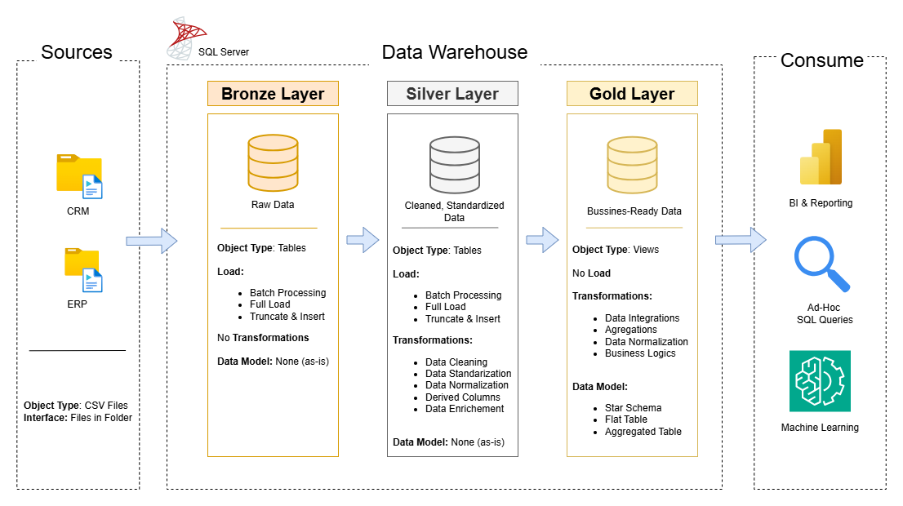
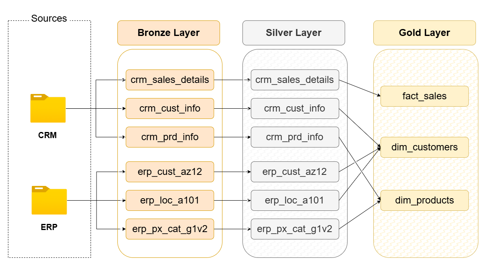
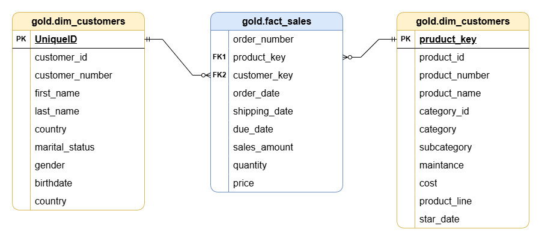

# Enterprise Data Warehouse Project (SQL Server) 🗄️

## 📌 Project Overview
This project simulates a real-world **Enterprise Data Warehouse (EDW)** solution built entirely within **SQL Server**. The goal was to integrate disparate data sources (CRM and ERP systems) into a unified, clean, and business-ready data model.

I implemented a **Medallion Architecture** (Bronze, Silver, Gold layers) using T-SQL Stored Procedures to orchestrate the ETL process, ensuring data quality and historical integrity.

## 🏗 Architecture & Data Flow
The pipeline follows a modern ELT approach, transforming raw CSV files into a structured Data Warehouse.

### The Workflow:
1.  **Sources:** Ingestion of flat files (CSV) representing **CRM** (Customer Relationship Management) and **ERP** (Enterprise Resource Planning) data.
2.  **Bronze Layer (Raw):** Direct ingestion of data. Full loads are performed here to maintain a raw history. No transformations are applied (AS-IS).
3.  **Silver Layer (Cleansing):** Data cleaning, standardization (dates, currency), and deduplication. Primary keys are established here.
4.  **Gold Layer (Presentation):** Business logic applied. Data is modeled into Facts and Dimensions for reporting tools like Power BI.

## 📐 Data Modeling (Star Schema)
One of the key engineering challenges was designing a **Dimensional Model** optimized for analytical queries (OLAP).

### Medallion Layering Strategy

### The Gold Layer (Star Schema)
I designed a **Star Schema** consisting of one Fact Table (`fact_sales`) surrounded by Dimension Tables (`dim_customers`, `dim_products`). This structure optimizes query performance for aggregations and filtering.

*   **Fact Table:** Contains transactional metrics (Sales Amount, Quantity).
*   **Dimensions:** Contain descriptive attributes (Customer Name, Product Category) to slice and dice the data.

## 🛠 Tech Stack
*   **Database:** Microsoft SQL Server.
*   **Language:** T-SQL (Transact-SQL).
*   **Concepts:** DDL (Data Definition), DML (Data Manipulation), Stored Procedures, Views, Keys (PK/FK).
*   **Architecture:** Medallion Architecture, Kimball Dimensional Modeling.

## 🧠 Key Engineering Challenges
*   **Data Integration:** Merging customer data from two different systems (CRM and ERP) that had different schema structures.
*   **Data Quality:** Handling `NULL` values and inconsistent date formats during the transition from Bronze to Silver.
*   **Normalization vs. Denormalization:** Transforming highly normalized transactional data (3NF) into a denormalized Star Schema for the Gold Layer to improve read performance.

## 🚀 How to Run
1.  Clone the repository.
2.  Execute the `01_init_database.sql` script to create the database and schemas.
3.  Run the **Bronze** scripts to load the raw CSV data (Bulk Insert).
4.  Execute the **Silver** stored procedures to clean and transform the data.
5.  Execute the **Gold** scripts to populate the Fact and Dimension tables.
6.  (Optional) Connect Power BI to the Gold Views for visualization.

---
**Developed by:** [Julian Gomez Gonzalez](https://www.linkedin.com/in/julian-gomez-gonza)  
*Electronics Engineering Student @ UNAL | Aspiring Data Engineer*
